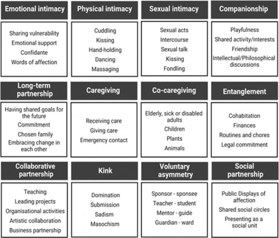

---
# === 基础信息 ===
title: "关系安那其主义的伦理学"
# slug: "ra-ethics"
description: "本文旨在介绍并辩护关系安那其（RA）。RA源于酷儿与反主流文化运动，主张将安那其主义反对统治者的核心精神引入私人领域，挑战亲密关系中的权力动态与主流规范。作者将其定位为一种应用伦理学理论，探讨其与多边恋的区别，并从后果主义等伦理框架论证其正当性，提倡建立非强制、自主的成年人关系。"
# cover: { image: "./cover.jpg", alt: "封面" }

# === 内容元数据 ===
source: "authorized" # collected(采集)|authorized(授权)|original(原创)
is_translated: true
ai_generated: 1 # 0(人工)|1(辅助)|2(生成)
author: ["Ole Martin Moen", "Aleksander Sørlie"]
translator: ["Jeambo"]
original_url: "https://theanarchistlibrary.org/library/ole-martin-moen-aleksander-sorlie-the-ethics-of-relationship-anarchy"
# book: "书名"
tags: ["RA"]

# === 时间与状态 ===
date: 2026-02-28
pubDate: 2026-02-28
lastUpdated: 2026-02-28
draft: false

# === 功能开关 ===
# tableOfContents: false
# prev: false
# next: false
editUrl: false
---

Ole Martin Moen, Aleksander Sørlie

原文年代：2022

译者：Jeambo

## 1. 导言

论及安那其主义[^1]时，人们心中所想者，多为*政治*安那其主义，即主张不应存在国家（state）。然而，哲学家兼安那其学者大卫·米勒（David Miller）指出，安那其主义本身其实是一种更具普遍性的看法，即主张*不应有统治者*（*no ruler*）。米勒写道：“尽管国家是安那其最显著的攻击对象，但绝非唯一。任何制度，只要在安那其主义者看来，如国家一般，表现出强制、惩戒、剥削或破坏的特征，皆会受到同等的谴责”——诸如宗教机构、学校或经济体系。（Miller 1984: 8）在此意义上，人们可以*对于*（*about*）各种不同事物持安那其主义立场。所谓关系安那其（relationship anarchy），即是私人关系领域的安那其主义。

已有多位安那其主义思想家对亲密关系发表过看法（如戈德温 Godwin 1793、巴枯宁 Bakunin 1866、高德曼 Goldman 1910）。但下文关注的中心，并非泛泛谈论安那其主义者对亲密关系的一般看法，而是一种将自己定义为“关系安那其者”的当代社会运动之理念。

这种意义上所说的关系安那其——以下简称 RA——在过去二十年里，是在酷儿（queer）和反主流文化（countercultural）的社群中发展起来的。RA 理论家们并非重点关注政治权力的机制，而是致力于理解并挑战亲密关系中的权力动态。该运动的核心奠基理论家安迪·诺德格伦（Andie Nordgren）将 RA 描述为一种激进的承诺，即承诺“不要通过两人互相施加权力的行为来定义此段关系[^2]”（Nordgren 2018）。

本文的目的，是为了对 RA 进行简明扼要的介绍与辩护。我们将把 RA 视为一种应用伦理学的理论——特别是性伦理和关系伦理的理论——并将其与这些领域中当下正在进行的辩论联系起来。我们两位作者均为酷儿男性（queer men），且都拥有反主流文化背景——在这些文化社群中，RA 得到了广泛的实践与讨论。我们其中一人是致力于跨性别者和性工作者权利的活动家（Sørlie），另一人是哲学教授（Moen）。虽然在 RA 的范围、内容和正当性这些方面，我们的确提出了一些主张，但在这个问题上，我们绝不宣称自己拥有任何特殊的权威。此外，我们在文中提出的许多观点，即使没有注明具体出处，也不一定算是我们独创，而是源于我们与RA社群中的其他人多年以来成果丰硕的讨论。

我们首先将从 RA 视角，考察那些当前主流关系规范显得*过于严苛*（*too restrictive*）的情形。然后我们再讨论那些显示出主流规范*过于宽纵*（*too permissive*）的情形。毫无疑问，我们关于什么是“主流”关系规范的看法，受到了我们斯堪的纳维亚写作背景的影响。

接下来，我们将探讨 RA 与多边恋（polyamory）之间的关系。我们认为，RA 兼容某些形式的多边恋实践，但并非全部。我们还认为，从 RA 的角度来看，日益流行的术语“合意非单偶制”（consensual non-monogamy）具有误导性，应避免使用。在结语中，我们将解释 RA 作为一种应用伦理学的立场，是如何在结果主义（consequentialist）、义务论（deontological）和德性伦理（virtue ethical）的框架下得以证成（justified）的。

在下文中，我们将讨论的范围限定于*成年人*之间*自主选择*的关系。因此，我们不讨论例如人与生俱来的亲缘关系，也不讨论成年人与未成年人之间的关系。诚然，许多问题和论点值得深入探索，远不止我们在本文中讨论的深度，然而，我们写作本文，是希望能传达出 RA 的主要性质和核心要义。

## 2. 主流关系规范的过严之处

过去一个世纪以来，关系规范（即关于人际关系应如何进行的规定）已变得越来越宽松。在西方世界及更广阔的地区，同性关系、跨种族关系、婚前性行为和离婚都已被广泛接受。尽管如此，诺德格伦（2006）在 RA 运动的奠基之作[《关系安那其简明指导宣言》](https://polycn.org/library/articles/theory/short-ra-instructional-manifesto/)中写道，仍然存在“一个非常强大的规范体系在起作用，它规定了什么是真爱，以及人们应该如何[经营他们的关系]。[^3]如果你不遵循这些规范，许多人就会质疑你以及你的关系是否真的站得住脚（validity）。”

这些规范是什么？它们在哪些方面过度严苛了？

欲理解 RA 之立场，可以从这个观察开始：我们从很小的时候就学会了将私人关系分为不同的类别。一个人可能是，比如，“朋友”、“约会对象”、“浪漫伴侣”或“配偶”。如果某段关系归属不明，我们往往急于把名分定下来。这是可以理解的，因为很多时候，关系分类不仅仅是用于*描述*：它们也被视为一种*规范*，规定了关系应该包含什么内容，以及该如何随着时间而发展下去。

让我们看几个例子。在友谊方面，大家普遍接受一个人可以同时拥有好几个朋友。然而，在浪漫关系方面，一个人在同一时间不能拥有超过一个伴侣。

在友谊方面，大家普遍接受：关系可以随着时间变深或变浅，这并不一定会导致友谊突然终结。相比之下，人们却通常期望浪漫关系沿着单向的轨迹发展下去。作家艾米·加兰（Amy Gahran, 2017）将此轨迹描述为“关系手扶梯”（relationship escalator）：一次或一系列约会（如果成功）应该升级为浪漫关系；浪漫关系（如果成功）应该升级为同居；同居（如果成功）应该升级为结婚并努力组建核心家庭[^4]。虽然也可以在升级之前，于某个阶段停留一段时间，但你必须得前进；否则，否则，这段关系就没有走上指定的“成功之道”，必不被人们视为成功了。此外，人们不能对这种关系进行降级，降级就意味着彻底结束。当这种关系结束时，对方就成了“前任”。在这种情况下，如果继续与那个人保持情感和（或）身体上的牵扯，就会让人觉得十分可疑。

诚然，如果已知一段关系属于某种类型，那么，它有沿着特定轨迹发展的倾向也是可以理解的。在许多情况下，遵循这种轨迹也可能是完全明智的做法。但从 RA 的角度来看，如果将某一种特定的发展路径规定成唯一合法的规范，认为该类别下的每一段关系都*应当*这样发展，那就会出问题。问题在于：我们人类并非只是“人类”这个分类下毫无二致的标准化样本（tokens）。相反，我们是具体的个人，有着具体的需求、欲望、计划、习惯、优点、身体和个性。没有两个人是完全一样的，也没有两种社交的情境是完全一样的。所以，正如诺德格伦所观察到的，“每段关系都是独一无二的”（Nordgren 2006）。

因此，根据诺德格伦的观点，我们不应该把我们生活中的人看作是各种关系类型的标准化样本。我们应该努力去关注我们在乎的人，将其当作独一无二的人来对待。基于每一段特定关系的具体事实——包括关系内每个人的价值观、需求和愿望——我们应该“与[我们]身边的人一起设计[我们]自己的承诺（commitment）。”[^5]（2006）

从这种意义上来说，“设计我们的承诺”可能包含哪些事情？请看下面的“关系安那其自助餐”（Relationship Anarchist Smorgasbord，图1），它勾勒了一段关系可能会涉及的一些核心领域，并指出了每个领域内有哪些选项可以用来“设计”：

（图1：关系安那其自助餐）

这个“关系安那其自助餐”图表是本文作者根据原版修订的，原版由温哥华多边恋社群的 Lyrica Lawrence 和 Heather Orr 于 2016 年创作。（译注：该自助拼盘工具已有2025版，并且有中文版，[参见此文](https://polycn.org/library/guides/boundaries/ra-smorgasbord-zh-cn/)）

在某些关系中，传统的要素组合和传统的发展轨迹，对关系里的各方来说都是很好的选择（考虑到他们的价值观、环境、需求等）。但在有些情况下，其他的选择可能更理想——例如——建立一种长期的伴侣关系，包含同居、彼此照料、财务交织（financial entanglement）和情感亲密，但这段关系中的一方或多方也可以在其他关系中寻求身体和性亲密（正如某些形式的多边恋）。在另一些情况下，一段浪漫关系最好的形态也许是，纵然时间跨度几十年，但却一直没有同居。对于两个邻居来说，见面拥抱一下，享受催产素给人的美好感觉，这件事本身就可以是一件很值得的事情，即使这就已经是全部——他们不想增加见面的频率，也不想费神请对方到家里共进晚餐。

如果我们把自己局限在标准的“捆绑套餐”中，我们就会失去某些关系原本可以带来的好处——这些好处源于这段关系自身的特质，哪怕这一类关系并非都具备这些特质，但在这一段关系中，它们是真实存在的。

手扶梯式的规范是束缚性的。如果规定做了甲事之后*应当*（*ought to*）接着做乙事，做乙事之后*应当*接着做丙事，那么，那些想一起做甲乙二事、或者能受益于甲乙二事的人们，就会因为其中一方（或双方）不愿承诺去做丙事，而索性不去涉足甲乙二事。

某些要素的组合比其他组合更常见，这完全可以理解。然而，一段特定的关系应该包含哪些要素，取决于当事人的具体价值观、需求和环境，而不是取决于这段关系所属的类别。因此我们可以说，RA 拒绝基于分类的关系规范。

关系安那其主义者也拒绝那些植根于性别和性取向等分类的关系规范。为了说明这意味着什么，我们假设存在一位名为查尔斯（Charles）的男性，他在性方面几乎只被女性吸引，而且他发展浪漫关系的兴趣也只指向女性。根据主流的性取向分类，查尔斯会被认为是“直男”（straight）。

我们还可以假设，除此之外，查尔斯在性方面亦会被极少数的男性或非二元性别者所吸引——他的兴趣可能仅限于少数几种特定的性爱互动方式。在这极少数人中，有一个叫罗宾（Robin）的男性，而且我们发现罗宾也同样被查尔斯所吸引。根据 RA 的观点，即使查尔斯在社会上被归类为“直男”，即使罗宾属于一个查尔斯通常不感兴趣的类别，这些事情本身与查尔斯应当如何对待罗宾（例如，是否去追求性互动）是无关的。此外，查尔斯也不应担心，如果他和罗宾真的发生了性接触，他的类别就会从“直男”变成“双性恋”或“同性恋”，进而导致他未来必须遵守不同的行为规范。

分类的作用，如果是限制人们尝试各种可能性的意愿，使之回避潜在的各种有价值的亲密形式（比如“直男不能做那种事”之类的想法），那么这种分类就对人过于严苛了。如果我们因为害怕沾染上“同性恋”或“双性恋”的污名，而无法发生对彼此都好处多多的性关系，那将是很遗憾的事情。同理，如果这种污名还阻碍了——比方说，两个直男——之间的情感和（与性爱无关的）身体亲密，那也会是很遗憾的事情。

虽然追求偏离常规的关系、不遵循主流规范对关系之内容和走向的规定，可能会带来很高的回报，但这同时也要求人们更加明确自己的边界、喜好、计划和期待。越是离经叛道，身边就越没有现成的路可走。诺德格伦写道：

> 激进（radical）的关系必须以对话和沟通为核心——不要只把它当作有“问题”需要解决时才启用的紧急措施。在信任的语境下沟通。我们太习惯于人们不说自己真实想法和感受了——以至于我们不得不去读懂话外音、去推测他们的真实意思。（Nordgren 2006）

重要的是，RA 并不强求任何人去追求激进的关系。决定只拥有一个性和浪漫伴侣，并做出长期的承诺（例如只与这个伴侣共同承担抚育子女的责任），这是完全符合 RA 的。诺德格伦写道：

> 如果不与他人携手做成一些什么事情——共同建设生活、抚育子女、买一个房子，或者同甘共苦地一起成长——生活会丧失秩序和依托，人生会失去很多意义。这些事情通常需要人与人之间大量的信任和承诺才能做成。关系安那其不等于绝不承诺任何事——它指的是你与身边的人一起设计你们自己的承诺（Nordgren 2006）

## 3. 主流关系规范的过宽之处

在上一节，我们讨论了许多在关系安那其（RA）看来过于严苛的主流关系规范。然而，是否也存在过于*宽纵*的主流关系规范？

根据诺德格伦的说法，RA的一个根本关切是人们应当“避免通过试图对彼此行使权力来定义关系”（Nordgren 2018）。这使得我们不仅必须识别并反抗他人对自己行使的不当权力，同时也必须识别并消除自己对他人行使的不当权力。如此一来，这便限制了我们能如何与身边人相处。

最关键的是，这要求我们在向他人发出性或其他亲密行为的邀请之前，必须确保对方确实拥有接受或拒绝该邀请的真正自由。

哲学家奎尔·库克拉（Quill Kukla, 2018）最近精妙地阐述了这其中的核心理由。Ta 指出，“邀请某人去做某事”的行为（几乎）绝不仅仅是向对方传递中立的信息。邀请者通常是想要这件事（例如潜在的性互动）发生，或者至少想要探索这种可能性，否则根本不会开口。然而在许多情况下，人际之间不对等的权力关系（如依赖关系）意味着，受邀者可能有理由担心拒绝请求会带来社交、经济或职业生涯方面的代价。这也是为什么在等级关系中——即一方对另一方拥有（例如，受到制度支持的）不对等的权力或权威——几乎永远不应该出现性的邀约。虽然在某些情况下，告诉对方“不用害怕，拒绝了也不会有什么不利后果”可能已经足够了，但如果对方必须仰仗你日后的关照，而且对你的了解也没有深入到可以确信“拒绝确实不会带来任何风险”，那么从RA的角度看来，你压根就不应该问。

近年来，人们越来越认识到，时刻需要准备应对各种邀约（包括撩拨[^6]）是一种负担。因此我们需要中性的空间——特别是在职业的环境中——让人们不必担心会收到邀请，也不必费神寻找安全得体的方式去回应（见 Kukla and Herbert 2018）。

不过，发出邀约并非本节要讨论的主要问题。我们要探讨的，实则是*单偶制*（*monogamy*）。

不论谁选择了单偶制的行为方式（即：只拥有一个性爱和浪漫伴侣），这与RA是完全兼容的。没有谁有义务与自己不想要的人产生性爱和（或）浪漫的联系。因此，我们接下来要讨论的，不是单偶制行为方式这件事本身，而是“要求伴侣必须按单偶制的要求行事”的做法。

从RA的角度该如何看待这种要求？首先，RA兼容——其实是鼓励——通过协商来确定关系的范围与内容。此外，虽然某些关乎范围和内容的议题可以重新商榷、或者妥协折中，但是，一段关系的当事人，如果在进入或者维系这段关系前，对该段关系的性质提出了严格的要求，也是符合RA的。如果有谁把“浪漫伴侣同时也是居家伴侣”这件事看得很重要，并且希望伴侣也能体会ta对居家乐趣的兴奋劲儿，那么如果此人不愿投身一段“伴侣几乎所有的下午和傍晚都不在家”的关系，那也无可非议。虽然，要求伴侣在一周里的*所有*下午和傍晚都在家——无论按主流规范还是RA规范——是有些过分；但如果一定要将“正常情况下，伴侣大多数时候都能在下午和傍晚呆在家里”作为愿意投身这段关系的前提，亦属合理。

然而，请注意，单偶制的种种要求，既不针对你与伴侣之关系的范围，也不针对其内容。单偶制的要求所说的是：在与你不在一起的时间里（无论频率或时长），伴侣在与他人的关系中可以做什么。在性爱和（或）浪漫的领域，这是一种排他性的要求，它要求的是一种垄断特权，即唯有自己可以与另一方之性存在（sexuality）产生密切的关系（engagement）。

在浪漫关系的世界里，人们广泛地接受了排他性的要求。然而，请注意这类要求放在友谊中会显得非常怪异。假设有两个人，杰克和简，他们是一对朋友，都爱读书且常聚在一起讨论文学。然后杰克对简说，他认为讨论文学是“他们俩专属的事”，他愿意继续做朋友的唯一条件是简不能和任何其他人讨论文学——而且，这条规则甚至在杰克出城、忙别的事，或者仅仅是不想找简聊天的时候也适用。在这个例子中，杰克的要求显然是不妥的：这种控制和束缚已经超过可以接受的程度了。

重要的是，杰克不能用“简本人只愿意和他讨论文学”来为这一要求辩解。这个理由之所以没道理，是因为假如这一情况属实，那么杰克的要求就是多余的。这个要求的意义和效力，仅仅存在于简确实想跟其他人讨论文学的时候：这条要求的目的正是阻止她做这件事。

既然友谊中不应该存在排他性的要求，那为什么浪漫关系就可以？如果这里存在差异，就需要理由。让我们来看看几种可能的理由。

### 诉诸致孕风险

关于在浪漫关系中设立性爱排他要求（单偶制）这件事，在支持其正当性的各种论点中，有一条是诉诸致孕风险。致孕的风险为浪漫/性关系赋予了额外的严肃色彩（因为可能产生后代，从而带来重大的抚育义务）。这种论点认为，致孕风险为该领域的排他性要求提供了正当性。曾多次有人向我们提出，虽然RA规范在酷儿（queer）社群中或许合理——那里的性爱通常与生儿育女和抚养责任相分离——但这些规范不能推及占多数的异性恋群体中。

首先，许多酷儿RA理论家——包括该运动的创始人以及本文的一位作者——皆已为人父母。因此，暗示“有可能出现育儿的责任”不属于酷儿社群的议题，是并不准确的。其次，即便此类潜在责任确实值得担忧，也应记住，性亲密也存在很多完全没有致孕风险的形式；确切地说，多达数百种的性爱亲密形式都没有致孕风险，存在风险的只此一种：两个有生育能力的个体之间进行未充分防护的阴道—阴茎性交。第三，自1960年代以来，避孕药和堕胎权使得异性恋关系中的性更多地以愉悦而非生殖为中心；女性的就业机会和离婚权减少了依附性，推动异性恋关系走向更平等的权力结构。因此，在短短几十年间，异性恋关系运转的条件已经大大接近了酷儿关系一直以来的条件。

如果采取一种保守的看法来评价社会规范——即认为我们应当重视那些在特定前提下、经由时间检验而被证明可行的规范——那么我们现在应当更加重视酷儿关系规范，因为它们已在相关条件下证明了其可行性（这些条件也日益适用于主流文化的异性恋关系）。异性恋的关系规范历经数千年演化，是为了适应父权社会，那里的性与生殖紧密相连；而酷儿关系规范主要演化于性与生殖并不紧密连接的现代社会。此外，事实证明它们能够构建紧密且相互支持的社会环境，在过去二十年里甚至证明了，酷儿关系规范在面对诸如数字技术普及等各种急剧的变迁时，依然展现出了极强的韧性。

尽管如此，我们要承认，在许多关系中——尤其是涉及育儿责任的关系中——要求限制伴侣性活动的范围，避免使其暴露于承担育儿责任之风险（若该责任与当前肩负之责任不兼容），是正当的。但要注意，这类要求并非仅适用于育儿的责任。如果涉及承担财务、职业或其他照护责任，从而导致无法履行现有义务，此类要求同样具有正当性。

在此背景下，我们也将简要评论一下“感染性传播疾病（STIs）的风险”。许多没有致孕风险的性亲密形式仍可能有STI风险。保持警惕并采取措施避免感染，与RA并不相悖；对于某些人（例如免疫缺陷者）来说，这方面的警示也的确必要。然而，如果动机是为了降低感染风险，那么理应对所有（同等严重的）感染风险给予同等重视——这应包括伴侣从事高社交接触工作（如收银员、幼教老师或护士）所带来的风险。关注自身健康，本身并不能证明对“因伴侣与他人性亲密而感染”这一*特定*风险的过度关注是正当的。此外，这也不构成反对伴侣从事几乎没有STI风险的性亲密（例如许多形式的小众性癖好（kink）、乳胶衣恋物癖、以及围绕着使用性玩具而展开的性行为）之理由，更不构成反对那些风险适中（只要等待检测结果出来后就可以进行无保护性行为）的性亲密之理由。因此，诉诸STI风险，无法为通常理解下的那些单偶制之要求提供正当性。

### 诉诸“设定自己的条件”之权利

还有另一个支持单偶制要求之正当性的论点，即：一个人有权设定任何标准，作为自己进入或继续一段浪漫关系的条件。在考量这一论点时，必须区分“法律允许做的”与“伦理上可接受的”。如果该论点是指法律上允许做什么，那么它并不构成对RA的反驳。任何人都应该有自由以任何理由离开一段关系，而不必担心刑事起诉。

然而，并不能由此推导出：离开一段关系的任何理由在伦理上都具备同等的可接受程度。首先，如果“随意设定任何条件作为继续关系的前提”在伦理上是可以接受的，那么，我们可以假设，这一逻辑也适用于友谊。然而，正如我们前面在杰克和简的例子中看到的，杰克提出的继续关系之条件似乎是不可接受的；相反，由于其侵入性和控制性，该条件可谓是令人反感。

直觉上，对于许多维系浪漫关系的先决条件而言，情况亦是如此。试想这样一种场景：一个男人，因为妻子升职了，薪资超过了他——在他看来，这导致关系中的权力与声望出现了不恰当的倾斜——于是他结束与妻子的关系。这在伦理上是不可接受的。又假设他在关系刚开始时就把这一标准告诉她，从而劝阻她追求事业的进步，这恐怕也同样难以接受。或者，想象一个女人告诉丈夫，如果不让她监听他与朋友家人的所有通话，她就要分手。对伴侣强加如此的要求，属于社交孤立和控制行为，构成了心理虐待（abuse）。

或许有人会回应说，这两个例子中的配偶，应该断然拒绝，对这些要求说“不”。我们同意，在理想情况下，他们理当如此。但同时我们必须承认，一个人可能处于这样的境地：那些条件是被当作关系存续的基础而强加给自己的，如果直接“拒绝”，代价可能极其高昂。即便不谈潜在的人身威胁，一个人可能在经济、社交或心理上对伴侣有所依赖，以至于除了接受这种虐待之外，做任何其他选择的风险都太大了。

显然，当亲密关系中的两个人共同做某事时，双方的同意（agreement）是该行为在道德上可以接受的*必要*条件。但这并不意味着，双方同意也是该行为在道德上可接受的*充分*条件。

为了防止权力不对等关系中出现虐待行为，有一个关键的方法：限制协商内容的范围（见 Waltzer 1983）。这一点在劳动合同中已被广泛接受。虽然一些自由意志主义者可能表示反对，但我们大多数人认为，对于什么可以写入劳动合同，以及何时可以再次协商、如何再次协商，应该有明确的限制。原因是，如果没有这些限制，我们就有可能面临极端的剥削行为。例如，设想一名员工的生活突然遭遇危机，此时一旦失业，其家庭将遭遇毁灭性的打击，而雇主得知后，借此机会，在劳动合同中提出过激的要求。即便换成更加日常的情形，大多数人应该也会反对那种，例如，规定雇员在非工作时间只能和哪些人交往的劳动合同。虽然雇主与雇员之间的权力不对等可能十分悬殊，但我们必须承认，许多人在家里，甚至还要面对比工作中更加严峻的权力不对等。我们的意思是，如果人们如果他们做了惹恼了雇主的事，其所产生的恐惧，要小于惹恼家庭伴侣所产生的恐惧。虽然人们的生计可能依赖于工资，但市面上通常还存在其他的雇主，且雇主对私生活的干涉程度也是有限度的。同理，基于这一原因，我们需要在家庭关系中设定界限，限制哪些事情在社会共识上是可以拿来讨价还价（协商）的。换言之，必须存在某些特定的领域，在这些领域中，无论当前是否存在权力不对等，亦或随着时间推移会演变出怎样的权力不对等，个体的选择和行为都不能受制于拥有更大权力的一方。

RA的倡导者会说，对伴侣生活中的诸多领域提出控制的要求，是不可接受的。然而，这类领域有一个关键的例子，即：当你不在场时，你的伴侣在与他人的关系中做了什么。此外，请记住这里的主张是关于*道德*层面的可接受性——相比之下，在劳资关系中，通常的观点是，这种对“哪些领域可供协商”的限制，应该由法律或政治手段强制执行。

把这个类比带回到友谊中，我们可以提问：上述分析是否意味着，根据朋友和你不在一起时的行为来评价他们，是错误的？要说它并非错误，也有一个理由：一个人的所有行为都反映出其本性，无论你是否在直接观察。如果你得知一个朋友在网上骚扰他人并鼓吹种族主义观点，这完全可以作为结束友谊的正当理由。如果你是素食主义者，并且在赋予这件事很重要的伦理意义，那么如果伴侣和你不在一起时去大肆吃肉，就完全可以构成你表示不满的依据。有些行为，无论与谁做都是错误的，那么即使在只有你们两个人的时候去做，同样也是错误的。但这不能套用到单偶制的要求里。大家应该都会认为，彼此同意（consent）的成年人之间发生性的亲密，在道德上是容许的，尤其当与人发生此类互动的主角是你自己时。因此，诉诸上述推理逻辑，并不能证明单偶制要求的正当性[^7]。

### 诉诸嫉妒

哲学家罗杰·斯克鲁顿（Roger Scruton, 1989/2001）通过诉诸嫉妒，来为单偶制的规则辩护。他写道，嫉妒使人“被恐怖的念头与幻想死死缠住，并沦为其猎物”，还说它“通过摧毁爱人是独一无二的这个神话，粉碎了他的世界”（164）。斯克鲁顿建议，“在性道德的起源中，嫉妒的力量是需要考虑的最重要的事实之一”（167），需要考虑这些的情形，当然也包括捍卫单偶制规则的时候。

这个论点的一个问题是，单偶制的规则并没有消除嫉妒。毕竟，在那些由单偶制规范主导的关系中，嫉妒依然泛滥不止。在我们看来，明显是单偶制规范让嫉妒得以长期存续，因为这些规范加剧了人与人之间必须展开的竞争。既然单偶制规范规定*只有一个*人能成为伴侣的亲密对象，那么其他人，一旦你的伴侣有兴趣与之亲密，就确实构成了威胁，因为在这种情况下，那些人势必要取代你。在单偶制下，没有余地让你的伴侣既与别人时不时亲密一下，又继续当你的亲密伴侣和居家伴侣。哲学家哈里·查默斯（Harry Chalmers）在谈到浪漫及其他形式的嫉妒时写道：“嫉妒最容易滋生的环境，就是人们拒绝共享的时候。”此外他还指出，“单偶制并没有直面嫉妒所提示出来的深层需求或问题，而仅仅是一种避免触发嫉妒情绪的方法”（Chalmers 2019: 236–237）。

在考虑如何处理成人的嫉妒时，关系安那其主义者建议，将其与我们处理儿童嫉妒的方式联系起来看待，是十分有益的。儿童经常会表现出嫉妒和强烈的占有欲，无论是对物品还是对人。他们可能要求任何人都不能碰自己的玩具，哪怕自己并不在场；兄弟姐妹之间也可能因为父母的注意力转移到了其他孩子身上而产生嫉妒。梅·比（Mae Bee）在《关于自由与爱的绿色安那其项目》中写道：

> 幼儿看到母亲的怀抱中有了新弟妹，通常会表现出极度的嫉妒、强烈的竞争感与愤怒，归根结底是出于占有欲。作为成年人，我们对此报以同情，但不会感到惊恐。我们并不期望母亲把新来的孩子赶走，或者把她对新孩子的爱隐藏起来、避开大孩子的视线范围。相反，我们期望母亲安抚大孩子，使之确信妈妈仍然爱着他（it）、关心他，同时也让大孩子知道，妈妈也爱着、关心着新宝宝。（Bee 2004）

值得注意的是，我们在处理嫉妒的问题上，对儿童的要求竟然比对成人还要高。查默斯也谈到了这一点，他写道：“伴侣应该正面直视他们的嫉妒感受。他们应该对自己的情绪负责，设法克服自身的不安全感，努力将自己从最初引发问题的恐惧和错误预设中解放出来。简而言之，他们应该走上更为成熟的道路”（Chalmers 2019: 236）。

但这并不意味着我们应该简单地无视成人的嫉妒：它确实是一种令人痛苦的情绪。此外，处理这种情绪的方法，并非运用权力去主宰他人的生活和关系。同样需要强调的是，虽然嫉妒在发作时感觉像是本能的、不可避免的，但我们对这种情绪的理解、将其概念化（conceptualize）的过程、以及应对它的方式，其实具有社会偶然性（socially contingent）。处理这种情绪的方法，可以是积极培养所谓的“*同喜*”（*compersion*）：即为伴侣的喜悦而感到喜悦，包括伴侣的喜悦源于与他人产生性亲密行为的情况（见 Sousa 2017; Brunning 2020）。

有一个值得在此指出的现象，可以作为“社会偶然性”的例证：在瑞典语（RA宣言最初使用的语言）中，嫉妒一词是 *svartsjuka*，直译为“黑病”。因此，嫉妒在那里被定性为一种不健康的反应。

我们要指出的另一点是，如果“避免伴侣产生嫉妒情绪”这一目的，算得上一条很有分量的考虑因素，足以正当地限制一个人与他人的关系，那么照理来说，它也应该也限制一个人以“可能引起怀疑”的方式与他人互动。为了保护妻子免受嫉妒之苦，丈夫有了规范性的理由（normative reasons），去避免与女性建立亲近的（即便没有性意味）友谊，并确保自己不处于那种若被妻子的亲朋好友撞见就会引发怀疑的场景中。

这生动地展示了单偶制的要求——尤其是当以嫉妒作为理由时——可以是多么具有侵入性和束缚性。也难怪许多直男缺乏亲密且具有情感支持的关系：因为恐同，他们必须限制与其他男性在情感上的亲近；因为单偶制规范，他们又必须限制与其他女性在情感上的亲近。

### 诉诸性亲密

哲学家凯尔·约克（Kyle York）亦为单偶制辩护，他的论点是：人们“在知道自己不会被拿来与他人比较的时候，在性方面彼此都会更尽力，和（或）感到更放松、更自信”（York 2020: 551），而这反过来会增强性亲密（sexual intimacy）。

诚然，对于某些人来说，采取单偶制的行为模式，可能确实能增强性亲密。在这种情况下，这些人实行单偶制可以说有着不错的理由。在这方面，RA唯一反对的是将单偶制作为一种要求强加于对方，并伴随显性或隐性的威胁：如果不能顺从，那就结束关系。对此可能会有人回应说，对于关系中的性亲密而言，有一点也很重要，那就是伴侣不因与他人发生性行为而“耗尽”性欲。RA对此的回应稍微复杂一些。一方面，高度重视与伴侣的规律且高质量的性亲密没有错；如果伴侣在家时，性欲已经只剩下一点“残羹冷炙”了，那不愿继续这段关系也没有错。然而在这种情况下，问题的核心仍然在于：你和伴侣在一起会做什么。伴侣为了满足你看重的关系价值，可能会决定减少甚至不与他人发生性接触。时间和精力是有限资源，这是无法回避的事实（即使爱是无限的！）。关注你与伴侣这段关系的实际内容——而伴侣选择如何与他人共度时间，也确实会影响到这些内容——是无可非议的。

RA也拒绝这样的前提条件：即一个人可以合理地要求，其性需求仅由伴侣一人来满足。虽然，鉴于单偶制规范的盛行，可以理解为什么很多人都接受这一前提，但从RA的角度看，这就像要求自己所有的其他需求都必须由伴侣独自满足，而不能通过（比如）与他人的友谊来满足一样不合理。在性满足的领域如此苛求，对于那些伴侣间性欲强度显著不对称，或者一方（例如因焦虑、抑郁、躯体状况、药物）长期完全丧失性欲的单偶关系，可能会产生极其负面的影响。在那些情形中，单偶制规范除了结束关系外只留下了两种解决方案：要么无性欲的一方必须进行自己不想要的性行为，要么另一方必须将性生活限制到只能自慰的程度，从而陷入形同单身的无性生活状态（celibate），即使对他们来说，性的亲密其实很重要。在这里，单偶制的规范构成了一种威胁，危及到了高质量的性亲密。

单偶制威胁性亲密的另一种方式是，它阻碍了双方诚实地沟通自己想要的性亲密类型。为了说明这一点，假设单偶关系中的一方有兴趣尝试某些小众性癖好（见本卷 Garcia 的文章）。他们应该告诉伴侣吗？一种可能是伴侣刚好也对这些性癖好感兴趣，那样的话，说出来可能会带来好的结果。然而，也存在一种非常现实的可能性，即伴侣并没有与之兼容的性癖好。

回想一下库克拉的警告：让别人知道你有兴趣做某事，并不是传递中立的信息，而是表达你希望这件事发生。在单偶关系的语境下，分享对小众性癖好的兴趣，无论本意如何，都在传达这样一个信息：要么我们一起做这件事，要么就是因为你选择不做、所以我实现不了对这类性亲密的渴望。这把对方置于两难境地。如果不希望让伴侣为难，人们就会缺乏进行诚实沟通的动力。此外，还需要注意，如果你告诉了伴侣你的性癖好，而他们偶尔和你做这类活动，你很难知道他们是真的喜欢，还是为了让你满意而做。原因在于，如果他们只是为了让你满意而做，他们很可能会清楚地意识到：比起只是顺从地满足你，如果他们自己也喜欢，你会更开心的。他们可能还会做出一个正确的预判：如果你知道了真相是后者（为了让你满意才做），你会感到痛苦。只要他们想让你满意，他们就不敢诚实沟通，甚至还有动机去假装喜欢、并做出虚假的性反应。

在不受单偶制规范主导的关系中，把自己在性方面的兴趣爱好告诉伴侣，几乎不会给对方带来负担。因为如果兴趣不匹配，自己可以与他人追求这种性兴趣。同理，作为回报，对方在性沟通上也将更加开放。

### 诉诸稳定性

另一个论点认为，单偶制是维持稳定性所必需的。约克写道，虽然对于不涉及太多情感亲密的性接触未必如此，但“有些关系一开始只是随意的性关系，之后很容易变得越来越重要（significant），因此可能需要排他性协议作为防护”（York 2020: 542）。此外，约克坚持认为，单偶制有助于让人相信伴侣不会在机会出现时“攀高枝（trading up）”（即发现自己更喜欢和别人在一起后，就选择离开你而飞向他人），这使得“我们的共同生活……维系于这样一个事实，那就是我还没找到更适合我的人”（York 2020: 547）。

虽然约克提出这个论点是为了支持单偶制的规范，但我们很难看出它如何能用来支持当代的单偶制规范，因为当代的单偶制允许结束旧关系、开启新关系。约克的观点，真要说的话，倒不如说是在反对的是接受和（或）允许离婚。此外，还要注意，单偶制规范大大增加了他人对现有关系构成威胁的程度。在单偶制的规范下，一个人的伴侣只能拥有*一个*性和（或）浪漫伴侣。这意味着，伴侣对他人的任何亲密追求、私情或迷恋（infatuation）都会被视为威胁。他们，*或者*你，只能选一个。一旦选了他们，你就会彻底失去与伴侣的关系。

既然我们知道迷恋是极其常见的（abound），单偶制规范非但没有让关系稳固，反而让关系变得脆弱。此外，这种脆弱性不仅会影响关系中的当事人，也会影响孩子。对于在严格的单偶制核心家庭中成长的儿童，只需父母任何一方与伴侣以外的任何人发生哪怕一次性亲密行为，其主要的支持环境就极有可能破碎。

关于单偶关系这种本无必要的脆弱性，哲学家伯特兰·罗素（Bertrand Russell）所持的观点，让人在回望时不禁想视之为关系安那其者。罗素写道，婚外性行为受到了传统道德观念的误判，“传统道德观假定，在实行单偶制的国家里，被某一人所吸引，无法与对另一人的深厚感情共存。大家都知道这不是真的，但在嫉妒的影响下，大家都很容易退回到这个错误的理论上，从而小题大做。”罗素继续毫不妥协地指出，婚外性行为“绝不应该阻碍之后的任何幸福，事实上也确实没有什么障碍，只要夫妻双方自己觉得没必要沉溺于情节夸张、且毫无节制的嫉妒情绪之中”（Russell 1929: 231）。

在这个语境下，有一个有趣的词，凸显了由单偶制规范制造出来的脆弱性，那就是“家庭破坏者”（homewrecker）。这个词通常用以指代与已有伴侣的人发生性亲密行为的人。然而，如此使用这个词，可以说张冠李戴（misplaced），因为与一个知情同意的成年人发生性亲密行为，这件事本身并不足以破坏一个家庭。相反，与“家庭破坏者”这个词更直接相关的指代对象，应该是那个——在发现伴侣与自己以外的人亲密后——以“破坏家庭”作为回应的人。

话虽如此，我们也承认，如果“家庭破坏者”这个词是指对家庭破裂负有道德责任的人，那么它可以正当地指代这样的人：这种人要求关系必须单偶、却没能恪守自己提出的这一要求。然而，在那种情况下，他们之所以对关系的终结承担责任，原因是其虚伪与操纵行为，而不是他们与伴侣之外的人发生了亲密行为。

## 4. 关系安那其与多边恋

关于单偶制的讨论就到这里。那么多边恋（polyamory）——即同时与多人保持情感和（或）性亲密关系的做法——又如何呢？RA坚定地站在多边恋的捍卫者这一边，挑战“浪漫关系必须、或应当是两人相互独占”的这一前提。从RA的角度看，虽然这种二人状态（twosomeness）可能适合某些人，但没有理由将其视为任何人、更不用说所有人都应努力遵守的规范。此外，我们也有理由去批判这种“二人状态”在今日倾向于采取的形式，即：即存在于核心家庭的语境之中，或是为了促成核心家庭的建立。

虽然核心家庭可能对某些人适用，但为了用不偏不倚的视角来认识什么是真正的传统、什么是现代的实验性发明，我们要记住：核心家庭只是在工业革命前后，也就是150到200年前，才成为社会的主导单位（unit）。在人类过去绝大多数时间里，我们大多数人都生活在规模更大的家庭和农场中，在此之前则是生活在部落里。那时，抚育后代这项活动是有更多成年人共同参与的活动（综述见 Brooks 2020）。

经营核心家庭是一项充满风险的事业。除了我们在上一节讨论过的，由单偶制带来的风险外，核心家庭——即使不考虑单偶制规范——本身也能产生重大的风险。将抚育孩子的重担几乎全部压在两个成年人身上，是有风险的，特别是如果两人都必须全职工作时——而为了养活一个由两名成人及其子女组成的独立家庭，双方全职几乎是必需的。核心家庭极易面临退化为单亲家庭的风险，这将让一个成年人独自承担大部分或全部的主要育儿责任。正如卢克·布伦宁（Luke Brunning）所指出的，一个拥有多名成年人的家庭：

> 更能抵御外部冲击，如疾病、分手、收入起伏以及所有关系固有的无常性。这既体现在形式上，因为有多位伴侣提供支持，也体现在内容上，因为情感的劳动有助于人们应对变化。（Brunning 2018）

核心家庭在步入晚年时，还有一个重大的缺点，那就是当一方去世时，剩下的一方往往陷入孤立无援。

因此，尽管关系安那其者有理由支持多边恋，但RA并不兼容所有的多边恋实践。其中之一就是*多边恋的*排他要求，这类似于我们之前讨论过的单偶制排他要求。事实上，RA最初正是为了反对多边恋社群中的这种做法而发展起来的。诺德格伦写道：

> 多边恋似乎——至少对（2000年代初的）我们而言——正是那把能打开笼子的钥匙。但我们很快发现，这场运动同样把爱关进了笼子，只不过笼子里能容纳不止两个人。多边恋关系内部的规则有时似乎更加森严，在那里，爱不知怎么地变得既特别又危险。那些自愿进入笼子的人，既受控于他人，又被迫去控制他人的行为。我们的安那其原则容不下这样的笼子，也不希望把任何人——尤其是我们所爱的人——关进这样的笼子里。（Nordgren 2018: 75）

所谓的“多边忠贞”（polyfidelity），就是RA反对的一种多边恋实践。它一般被定义为：“一群人在彼此之间有浪漫或性关系，但他们的约定（agreements）不允许寻找额外的伴侣，至少在未经群体中所有人批准和同意的情况下是不允许的”（Veaux and Rickert 2014: 457）。

虽然多边分子团（polycule，一般都这么称呼）[^8]的每个成员都应当有自由去为自己做决定，将自己的性亲密限制在该团体的其他成员之内，但如果有人要求别人也必须这样做，这便与RA不兼容了，这和RA反对单偶制关系的此类排他要求是出于同样的理由。RA活动家梅·比（Mae Bee）引入了一个非常有用的术语“规则式关系”（rule relationships）：无论是单偶还是多边，只要其中的人制定规则去干涉自己并未参与的关系的内容，那就是规则式关系（Bee 2004）。关系安那其者拒绝这种关系。梅·比写道：“在一个自由社会中，我们想和某人上床不需要征求另一个人的同意，就像我们不需要向父亲请求娶他女儿的‘权利’一样”（Bee 2004）。

另一位化名为 Unquiet Pirate 的RA活动家写道：“关系安那其并不是一个大杂烩。”相反，RA是：

> 一种特定的亲密哲学。这种哲学的一个重要方面——我认为多边恋或‘后多边恋（post-poly）’人士往往会对这一点感到不安或直接忽略——是关系安那其拒绝一切关于监管亲密伴侣行为的论点，[以及拒绝]参与监管他人关系的规则/协议/合同……作为一名关系安那其者，我很有可能会偷走你的伴侣，因为我相信伴侣可以被‘偷走’这种观念不仅是屁话（nonsense），而且是压迫性的屁话。（Unquiet Pirate 2015）

出于类似的理由，RA也批判某些多边恋社群中将关系分级为“主要”（primary）或“次要”（secondary）的做法。诺德格伦写道：“不要在人与人之间、关系与关系之间进行排名和比较——要珍惜的，是每个人的个体存在，以及你与他们的联结。你并不需要为了让一段关系成为‘真正’的关系，来把你生命中的某个人命名为“主要”的。每段关系都是独立的”（Nordgren 2006）。关键在于，虽然你可能明显与一个伴侣同居而与另一个不同居，或者花在一个伴侣身上的时间比另一个多，但每段关系都是独特的。即使在现实中有必要分个轻重缓急（prioritize），但建立一个跨情境、跨目标的亲密关系人际等级制度，是与RA不兼容的。

最后，我们建议关系安那其者应该批判多边恋捍卫者中一种日益普遍的做法，即将多边恋的实践描述为“合意非单偶制”（consensual non-monogamy，如 Brunning 2018）。这种描述的重点在于，关系中的每个人都同意（consent to）其他人拥有额外性伴侣。虽然这在抽象层面上听起来很不错，但请注意此处是如何使用“合意”（consensual）一词的。

在大多数关于性关系之同意权的讨论中，我们关注的是发生性行为之当事人的同意。然而在“合意非单偶制”这个短语中，“合意”指的并不是性行为当事人的同意（如果是那样的话，这个短语就是在区分强奸和非强奸了）。相反，“合意”指的是第三方的同意。然而，尽管其实并不需要征得这个第三方的同意，这个说法却让人感觉好像是需要的。即使是那些支持多边忠贞的人，也应该支持将“性行为参与者的同意”与“第三方对此类性行为的所谓同意”区分开来，并且鉴于这种区别在道德上至关重要，还应该反对任何模糊这两者区别的做法。然而，当人们不清楚该术语是指性行为当事人的同意还是第三方的“同意”，这种关于“合意/非合意”的区别便恰恰遭到了混淆。[^9]

## 5. 结语

RA 敦促我们量身定制我们自己的关系：我们应该拒绝默认的“捆绑套餐”和基于类型区别的关系规范，转而去探寻是否有办法让每一段独特的关系将其潜力发挥到极致。同时，RA 呼吁我们要克制住，不去定制他人的关系：对我们在乎的人，我们应该给予足够的喘息空间，使之可以自己做决定，而不是威胁他们说：除非你与别人的关系服从于我制定的规则，否则我就撤回爱与支持。

RA 也会提规范性的主张，即：关于什么是可以接受的、什么是不可以接受的主张。RA 绝*不是*认为“怎么都行”。那是关系虚无主义。此外，RA 也不是认为“只要当事人同意，怎么都行”。那是关系自由意志主义（relationship libertarianism）。

RA 规范的效力从何而来？正如我们在上文所指出的，RA 的正当性可以在许多不同的规范框架内得到证成。

在结果主义（consequentialist）框架内，RA 的正当性，归根结底来自于它比传统模式能带来更大的福祉：例如，在某些特定关系中，如果死守那些基于分类的规范，对当事人来说并非实际上的最优选择，那么 RA 就会拒绝将这些规范强加于该关系之中；更广泛地说，RA 致力于促进诸如乐趣、亲密感、多样性和自由等益处，并努力抵制虐待性的关系互动模式（dynamics）与嫉妒，防止家庭毫无正当理由地走向破裂。

然而，在结果主义观点看来，RA 的原则并非绝对的原则；与所有结果主义理论一致，它们是手段而非目的本身。因此，例如，结果主义的 RA 观点会认为，我们有充分的理由在社会层面上普遍反对单偶制的要求，因为这些要求在大多数情况下是有害的。但是，这种观点并不排除，在某些情况下，这类要求可能并不会造成伤害（或者抵消后的净伤害）：例如，伴侣之间长期以来权力对等、且双方都有单偶倾向的情况。不过，结果主义的关系安那其者也可以说，单偶制的要求在这些情况下之所以没有造成伤害，是因为它们几乎没有起到作用——也就是说，本来也就不需要这些要求。

如果是以义务论（deontological）伦理框架作为 RA 的规范基础呢？在这里，RA 的原则就不再仅是作为手段而值得坚持了。义务论理论认为，某些行为和尊重他人的方式其本身就是善的（good in and of themselves），无论在特定情况下的后果如何。将 RA 联系到当前义务论的讨论中，RA 似乎与大卫·维勒曼（David Velleman）的提议相契合，即：我们应该将他人视为“自存的目的”（self-existent ends），这一观点的核心内容之一是，我们应该“珍视他们本来的样子（as they already are）”，并以“敬重（reverence）”的态度对待他们，也就是“退后一步，以欣赏的眼光看待[他们这些]理性生物，而不带有任何产生特定结果的倾向”（Velleman 1999: 358）。因此，例如，我们应该尊重伴侣的自主性，支持有利于他们蓬勃发展（flourishing）的事——即使这些事包括与别人有性的亲密——而不是试图为了换取我们自己的某些“好处（benefits）”而控制他们。

最后，在德性伦理（virtue ethics）框架内，RA 规范效力的正当性，归根结底可以通过其所提倡的行为来证成：这些行为体现了正直、诚实、勇气和宽容等美德，同时帮助我们防范怯懦、嫉妒和占有欲等恶习。

作为一种规范性理论，RA 也对我们提出了一些要求。我们应该反对反酷儿（anti-queer）的态度，并且在——例如，当人们把嫉妒奉为真爱之标志——的时候站出来表示异议，指出嫉妒更多时候是理所应得的权利欲（entitlement）和占有欲的标志。我们应该向伴侣表明（哪怕只是单方面承诺）：请他们放心，我们不会仅仅因为他们与他人亲密就结束这段关系。

作为关系安那其者，我们也应确保将健康的 RA 价值观传递给下一代。我们应该鼓励孩子们将同伴视为独特的个体；鼓励他们敢于询问、邀请并提议关系可能的发展方向，同时也注意要让对方安心，让他们知晓自己完全可以说“不”。我们还应该帮助孩子培养设定界限的能力，明确别人可以决定什么、不可以决定什么。如果学校里有人说可以和孩子做朋友——但条件是必须抛弃另一个朋友——孩子应该有信心坚定地回答：虽然很感谢对方想和自己深交的邀请，但我与另一个孩子现有的友谊，是不可以拿来讨价还价的。

## ‌参考文献

* Bakunin, Mikhail (1866). “Revolutionary Catechism” in Bakunin on Anarchy. Trans. and ed. by Sam Dolgoff. New York: Vintage Books, 1971.
* Bee, Mae (2004). “A Green Anarchist Project for Love and Freedom.” https://theanarchistlibrary.org/library/mae-bee-a-green-anarchist-project-on-freedom-and-love (accessed: 2021.08.02)
* Brooks, David (2020). “The Nuclear Family Was a Mistake,” The Atlantic, March 2020 Issue. https://www.theatlantic.com/magazine/archive/2020/03/the-nuclear-family-was-a-mistake/ 605536/
* Brunning, Luke (2018). “The Distinctiveness of Polyamory,” Journal of Applied Philosophy 35 (3): 513–531
* ——— (2020). “Compersion: An Alternative to Jealousy?” Journal of the American Philosophical Association 6(2): 225–245.
* Chalmers, Harry (2019). “Is Monogamy Morally Permissible?” Journal of Value Inquiry 53: 225–241.
* Gahran, Amy (2017). Stepping Off the Relationship Escalator: Uncommon Love and Live. Boulder, CO: Off the Escalator Enterprises LLC.
* Godwin, William (1793). Enquiry Concerning Political Justice and its Influence on Morals and Happiness. London: G. G. & J. Robinson.
* Goldman, Emma (1910). Anarchism and Other Essays. New York: Mother Earth Publishing.
* Kukla, Quill (2018). “That’s What She Said: The Language of Sexual Negotiation.” Ethics 129: 70–97.
* Kukla, Q. R., and C. Herbert (2018). “Moral Ecologies and the Harms of Sexual Violation.” Philosophical Topics 46(2): 247–268.
* Miller, David (1984). Anarchism. London: J. M. Dent.
* Nordgren, Andie (2006). “A Short Instructional Manifesto for Relationship Anarchy.” https://theanarchistlibrary.org/library/andie-nordgren-the-short-instructional-manifesto-for- relationship-anarchy (accessed: 2021.09.02)
* ——— (2018). “The Road to Relationship Anarchy.” Melk #6.
* Russell, Bertrand (1929). Marriage and Morals. New York: Liveright publishing.
* Scruton, Roger (1986/2001). Sexual Desire: A Philosophical Investigation. London: Phoenix Press.
* Sousa, Ronald de (2017). “Love, Jealousy, and Compersion.” The Oxford Handbook of Philosophy of Love. Christopher Grau and Aaron Smuts (eds). Oxford: Oxford University Press.
* Unquiet Pirate (2015). “Relationship Anarchy is Not Post-Polyamory” https://unquiet- pirate.wordpress.com/2015/11/03/relationship-anarchy-is-not-post-polyamory/ (accessed: 2021.08.30)
* Veaux, Franklin and Eve Rickert (2014). More Than Two: A Practical Guide to Polyamory. Thorntree Press.
* Velleman, David (1999). “Love as a Moral Emotion.” Ethics 109: 338–374.
* Waltzer, Michael (1983). The Spheres of Justice. New York: Basic Books.
* York, Kyle (2020). “Why Monogamy is Morally Permissible: A Defense of Some Common Justifications for Monogamy.” The Journal of Value Inquiry 54: 539–552.

:::note[版权信息]

Original text: The Anarchist Library Anti-Copyright

Ole Martin Moen, Aleksander Sørlie The Ethics of Relationship Anarchy 2022

Chinese translation: Jeambo 2026 Anti-Copyright

[原文链接](https://theanarchistlibrary.org/library/ole-martin-moen-aleksander-sorlie-the-ethics-of-relationship-anarchy)

:::

[^1]: 译者注：anarchism，一般称为无政府主义，更精确（但不常用）的说法是无治主义。本文选用传播较广的译法：安那其主义。

[^2]: 原文：to avoid defining relationships by attempts to exercise power over each other

[^3]: 此处的引文原本是 how people should live，本文作者将其改为 how people should [conduct their relationships] 。

[^4]: 译者注：核心家庭指的是由一对配偶及其未婚子女组成的家庭。

[^5]: 此处引文的原文是 it’s about designing your own commitments with the people around you，本文作者把 your/you 改成了 our/us 。

[^6]: 译者注：原文是 flirting。一般认为 flirt 对应的标准词汇是“调情”，但是调情的性意味太浓、目的性也很强，但是 flirting 的范围更宽泛，可以是仅仅为了活跃社交气氛或者制造乐趣，并不一定带有性的目的、也不一定是想推进关系，因此译为撩拨。

[^7]: 译者注：“上述推理逻辑”指的是“如果伴侣和别人做的事情本质上是错的，那么我可以将禁止这些事情作为我开始或继续一段关系的条件”。作者这里是说，既然“知情同意的性亲密”本质上并不是一件错误的事，这一逻辑便无法成立，也就是说，单偶制并不是在禁止伴侣做“错事”，而是在禁止伴侣把“好事”拿出去与别人做。这戳穿了单偶制拥护者们“契约自由”的道德伪装。

[^8]: 译注：指由多个多边恋者组成的关系，一般是封闭的。

[^9]: 译者注：作者在这里敏锐地指出两点，其一是不应滥用“同意”一词，混淆“性同意”和“第三方的允许”，有可能模糊了重要的道德界限；其二是因为词语里出现了“同意”，所以暗示着“须经过第三人（例如原配伴侣）同意”，但是由于RA的前提是“每个人都没有权利束缚他人的情感/性关系”，所以“合意非单偶制”是一个累赘的、甚至具有误导性的词语。但我们仍需注意，作者此处的前提是比较激进和超前的，现实中大多数人持有的是“不可能得到原配伴侣同意，原配伴侣也不应当同意”的单偶制思想，因此合意非单偶制一词至少能让人们意识到“原配伴侣是可以同意的”，有深刻的进步意义。而且为非传统关系命名，使其区分于以欺骗或强迫为基础的非单偶关系，也具有现实的赋权作用。
